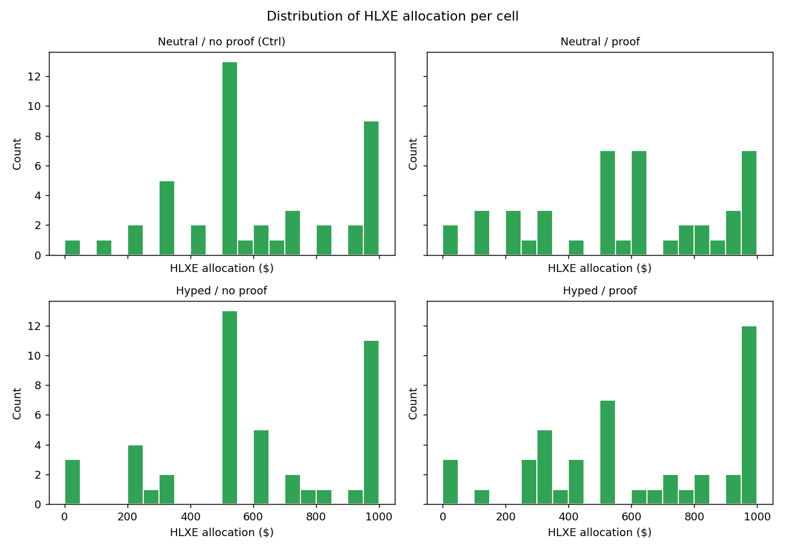
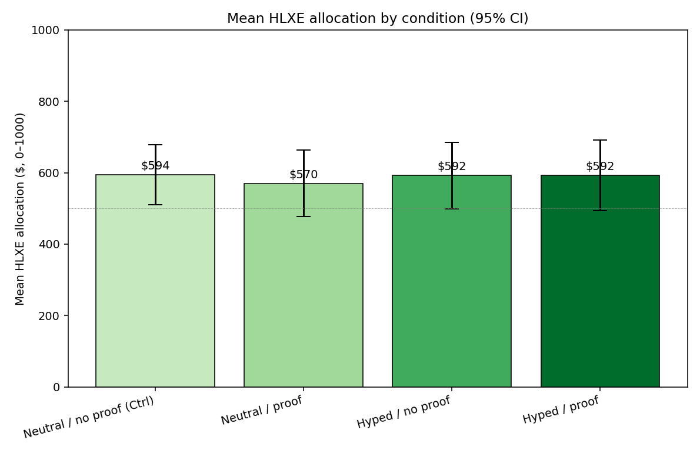
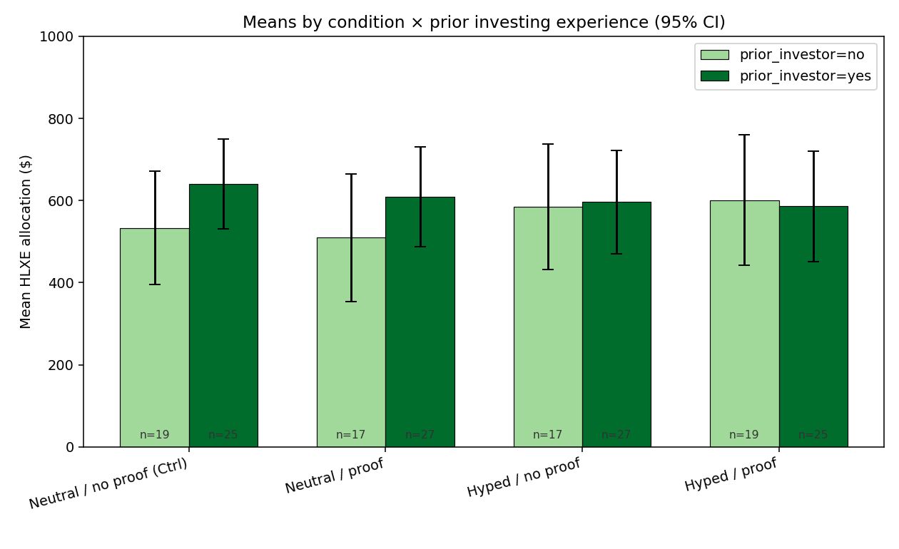
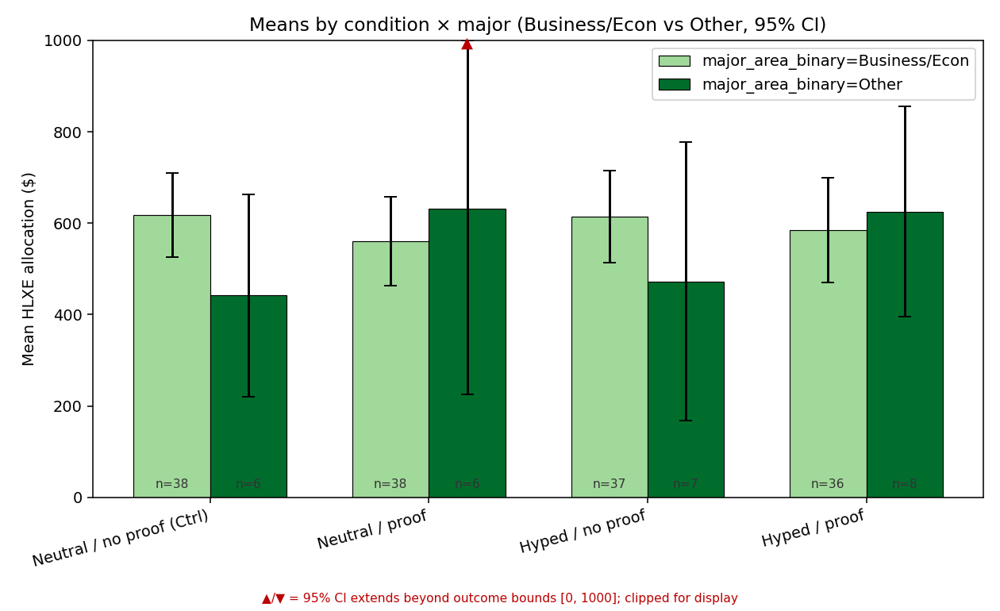

# MGT 160 Pilot — HLXE 2×2 Factorial: Results

> Study: identical fictional ETF (HLXE) shown with/without a popularity badge
> (`social_proof`) and with/without "HOT PICK" framing (`headline_type`).
> Each participant allocated a hypothetical \$1,000 between a guaranteed
> Treasury bond (+5%) and HLXE (uniform −25% to +25%). Primary outcome:
> `hlxe_allocation` (dollars 0–1000 into the risky ETF).

α = 0.05. All p-values reported to 3 decimals; Cohen's d and r to 2.

---

## −1. Motivation: why this question matters

**The decision environment we're studying.** Mobile-first retail brokerages (Robinhood, Public, eToro, Webull) have replaced traditional finance UIs — built around prospectus disclosures and risk metrics — with feed-style listing pages that surface *social* and *emotional* signals: trending lists, popularity badges, "most bought today," confetti animations on first trade. Roughly 30 million U.S. adults opened their first brokerage account between 2020 and 2023, the largest cohort of brand-new retail investors in a generation, and most of them are picking assets from interfaces that look more like a TikTok For You page than a Bloomberg terminal.

**Why we should care.** If a single UI cue — a popularity badge, a hype headline — can meaningfully shift how much of a portfolio a new investor steers into a risky asset, then UI-design choices made by brokerages have a *direct* welfare consequence for tens of millions of households. Even small shifts (a few percentage points of allocation) compound: behavioral nudges in the Save More Tomorrow literature (Thaler & Benartzi, 2004) produce 1–3 percentage-point allocation changes that translate into thousands of dollars over a working lifetime. The same logic, run in the *risk-taking* direction, is a consumer-protection and product-design question worth understanding empirically.

**What prior work suggests the cues should do.** Two well-replicated literatures motivate our manipulations:

- *Social-proof / herding.* Cialdini's "social proof" (1984) and a long line of follow-ups (e.g., Salganik et al. 2006 on cultural-market herding) show that signaling popularity changes choice probabilities even when the underlying option is held constant. Robinhood's "Top Movers" list has been shown observationally to concentrate trading on listed names (Barber, Huang, Odean & Schwarz 2022, "Attention-Induced Trading and Returns").
- *Hype / affective framing.* "Affect heuristic" work (Slovic et al. 2007) and a separate literature on positive-affect financial messaging show that warm/positive framing reduces perceived risk for the same underlying asset.

**The gap this pilot fills.** Both literatures predict an effect; neither has been tested in a clean factorial inside an ETF listing UI with allocation (not just choice) as the outcome. We hold the asset constant and randomize *only* the cues, so any allocation difference is causally attributable to the UI manipulation.

---

## 0. Design, randomization, and pre-registered hypotheses

**Treatments (2×2 factorial).** Identical fictional ETF — **HLXE / "Helix Renewable Energy ETF"**, a mid-cap renewable-energy fund — shown in four cells:

| condition | headline_type | social_proof | on-page manipulation |
|---|---|---|---|
| 1 (control) | neutral | no  | plain listing |
| 2 | neutral | yes | + popularity badge |
| 3 | hyped   | no  | + "Hot Pick" badge |
| 4 | hyped   | yes | + both cues |

**Exact stimulus copy (verbatim from `index.html`).**

- *Hype cue* (`headline_type=hyped`): a flame-icon banner at the top of the listing card reading **"Hot Pick"**. Replaced with empty space in `neutral` cells.
- *Social-proof cue* (`social_proof=yes`): a trend-up-arrow callout reading **"Most-bought ETF among college investors — this month"**. Hidden entirely in `no` cells.

All non-cue elements were held constant across all four cells: the ETF name (HLXE / Helix Renewable Energy ETF), prospectus text, performance card, holdings list, 3-yr/5-yr returns, fees, risk disclosures, fund tagline ("Diversified mid-cap renewable energy fund"), page layout, button copy, and color palette. The risk-free alternative was a guaranteed Treasury bond paying **+5%**; the risky ETF return was drawn uniformly from **−25% to +25%** and revealed after submission.

> Stimulus screenshots for the slide deck can be regenerated from `../index.html`; the conditional rendering lives at the `state.headline_type` / `state.social_proof` flags (search the file for those identifiers).

**Recruitment & implementation.**

- Self-administered single-session web app at `index.html`; participants completed it on their own device in roughly 1–3 minutes.
- Recruited via the MGT 160 course participant pool at UC San Diego (Rady School of Management) and adjacent personal/social networks of the project team.
- Top 3 final portfolios paid via Venmo as a real-stakes incentive layered on the hypothetical allocation.

**Timeline.** Data collection ran **2026-05-20 through 2026-05-28** (8 days). N = 176 complete responses (44 per cell).

**Unit of randomization:** individual participant. **Method:** server-side block randomization across the 4 cells (target 25% per cell) — realized assignment was perfectly even (44 per cell, see Section 1). Condition is assigned on first page load and recorded with the response; participants do not see the other three cells.

**Primary outcome.** `hlxe_allocation` (dollars 0–1000 into HLXE; the complement, `safe_allocation = 1000 − hlxe_allocation`, goes into the Treasury bond). A purely "no-cue, no-allocation-bias" baseline under a 50/50 split would be \$500; the **observed control-cell mean (\$594) is the empirical baseline** the treatment cells must beat. Observed SD across the full sample is **\$301**.

**Pre-registered hypotheses.**

- **H₀ (primary):** treatment cues have no effect on `hlxe_allocation` (β_social_proof = β_headline_type = 0).
- **H₁ (primary):** social proof and/or hype framing *increase* `hlxe_allocation` vs control.
- **H₁ (subgroup — `prior_investor`):** participants with prior real-money investing experience are *less* susceptible to the cues (negative `condition × prior_investor` interaction). *Rationale:* having executed real trades exposes a person to real losses, which should make them more skeptical of marketing surfaces and more reliant on fundamentals.
- **H₁ (subgroup — `major_area_binary`):** Business/Econ majors are *less* susceptible than non-Business/Econ majors (negative `condition × major` interaction). *Rationale:* coursework in finance/behavioral economics should give Business/Econ students conceptual exposure to social-proof and affect-heuristic effects, partially inoculating them.

**Pre-registered power target.** α = 0.05, target power = 0.80, two-sided independent t-tests. See Section 6 for the MDE we were powered to detect.

**Secondary outcomes measured (mechanism / heuristic-substitution check).**

- `confidence` (self-reported, 1–5, captured *pre-reveal*) — does the cue inflate certainty even if it does not change behavior?
- `time_on_page_seconds` / `time_to_submit_seconds` — does hype framing shorten deliberation, consistent with cue-driven (System-1) substitution? *Instrument caveat:* these two columns are byte-identical in the export — the form logged one timestamp for both. Treat them as a single timing measure.

---

## 1. Sample summary

Total N: **176**

Per-cell N:

| condition | headline_type | social_proof | N |
|---|---|---|---|
| 1 | neutral | no | 44 |
| 2 | neutral | yes | 44 |
| 3 | hyped | no | 44 |
| 4 | hyped | yes | 44 |

Attention-filter flags (FYI only — not excluded): 0 row(s) <10s, 4 row(s) >600s (out of 176 total).

---

## 2. Balance / randomization check

| variable | test | statistic | p |
|---|---|---|---|
| age (mean) | one-way ANOVA | F=0.97 | 0.407 |
| gender | chi-squared | stat=4.66, dof=6 | 0.589 |
| year_in_school | chi-squared | stat=19.83, dof=15 | 0.179 |
| major_area | chi-squared | stat=5.49, dof=12 | 0.939 |
| prior_investor | chi-squared | stat=0.38, dof=3 | 0.945 |

Per-condition descriptives:

| condition | N | age (mean) | % woman | % man | % business/econ | % prior investor |
|---|---|---|---|---|---|---|
| 1 | 44 | 21.7 | 40.9% | 59.1% | 86.4% | 56.8% |
| 2 | 44 | 21.91 | 34.1% | 61.4% | 86.4% | 61.4% |
| 3 | 44 | 20.45 | 36.4% | 63.6% | 84.1% | 61.4% |
| 4 | 44 | 20.55 | 31.8% | 63.6% | 81.8% | 56.8% |

Verdict: **Balanced** — no significant imbalance detected.

### Outcome distribution

Distribution is reasonably continuous; the dollar mean is interpretable.

---

## 3. Primary results

### 3a/3b. Main effects (full sample, Welch's t-tests)

| effect | mean_a | mean_b | diff | ci_low | ci_high | t | df | p | cohens_d | n_a | n_b |
| --- | --- | --- | --- | --- | --- | --- | --- | --- | --- | --- | --- |
| social_proof (yes − no) | 581.300 | 593.200 | -12.000 | -101.800 | 77.900 | -0.260 | 173.000 | 0.793 | -0.040 | 88 | 88 |
| headline_type (hyped − neutral) | 592.200 | 582.300 | 9.900 | -80.000 | 99.700 | 0.220 | 172.900 | 0.828 | 0.030 | 88 | 88 |

### 3c. 2×2 ANOVA — `hlxe_allocation ~ headline_type * social_proof` (full sample)

| index | sum_sq | df | F | PR(>F) | partial_eta2 |
| --- | --- | --- | --- | --- | --- |
| C(headline_type) | 4290.688 | 1.000 | 0.047 | 0.829 | 0.000 |
| C(social_proof) | 6300.051 | 1.000 | 0.068 | 0.794 | 0.000 |
| C(headline_type):C(social_proof) | 6566.051 | 1.000 | 0.071 | 0.790 | 0.000 |
| Residual | 15846308.705 | 172.000 | n/a | n/a | n/a |

### 3d. Headline figure

**Plain-English takeaway.** Social proof shifted allocation by **$-12 (-2.0%)** (95% CI [-102, 78], p=0.793, d=-0.04). Hype framing shifted allocation by **+$10 (+1.7%)** (95% CI [-80, 100], p=0.828, d=0.03). The 2×2 ANOVA's main effects mirror the two t-tests above; the interaction term tests whether the cues compound. If the interaction is non-significant the cues behave additively; if it is significant and negative the cues are redundant (one cue already maxes the effect); if significant and positive they are synergistic.

### Binary fallback outcome (`took_risky_bet` = 1 if `hlxe_allocation` > 500)

| contrast | Pr(risky) group A | Pr(risky) group B | log-odds (A vs B) | p |
|---|---|---|---|---|
| social_proof (A=yes, B=no) | 0.51 | 0.48 | 0.14 | 0.651 |
| headline_type (A=hyped, B=neutral) | 0.49 | 0.50 | -0.05 | 0.880 |

---

## 4. Subgroup analysis (pre-specified moderators)

### 4a. Prior investing experience (`prior_investor`)

3-way ANOVA — `hlxe_allocation ~ headline_type * social_proof * prior_investor`:

| index | sum_sq | df | F | PR(>F) | partial_eta2 |
| --- | --- | --- | --- | --- | --- |
| C(headline_type) | 3908.421 | 1.000 | 0.042 | 0.838 | 0.000 |
| C(social_proof) | 9062.411 | 1.000 | 0.098 | 0.755 | 0.001 |
| C(prior_investor) | 109981.944 | 1.000 | 1.183 | 0.278 | 0.007 |
| C(headline_type):C(social_proof) | 9268.760 | 1.000 | 0.100 | 0.753 | 0.001 |
| C(headline_type):C(prior_investor) | 117736.241 | 1.000 | 1.267 | 0.262 | 0.007 |
| C(social_proof):C(prior_investor) | 3271.212 | 1.000 | 0.035 | 0.851 | 0.000 |
| C(headline_type):C(social_proof):C(prior_investor) | 799.617 | 1.000 | 0.009 | 0.926 | 0.000 |
| Residual | 15613811.595 | 168.000 | n/a | n/a | n/a |

Cell means by `prior_investor`:

| prior_investor | headline_type | social_proof | mean | std | count |
| --- | --- | --- | --- | --- | --- |
| no | hyped | no | 585.100 | 296.300 | 17 |
| no | hyped | yes | 600.700 | 329.900 | 19 |
| no | neutral | no | 533.000 | 286.700 | 19 |
| no | neutral | yes | 509.400 | 301.200 | 17 |
| yes | hyped | no | 596.500 | 317.800 | 27 |
| yes | hyped | yes | 585.900 | 326.300 | 25 |
| yes | neutral | no | 641.100 | 264.800 | 25 |
| yes | neutral | yes | 608.600 | 307.300 | 27 |

### 4b. Finance training (`major_area_binary`: Business/Econ vs Other)

3-way ANOVA — `hlxe_allocation ~ headline_type * social_proof * major_area_binary`:

| index | sum_sq | df | F | PR(>F) | partial_eta2 |
| --- | --- | --- | --- | --- | --- |
| C(headline_type) | 4776.583 | 1.000 | 0.052 | 0.820 | 0.000 |
| C(social_proof) | 5761.044 | 1.000 | 0.062 | 0.803 | 0.000 |
| C(major_area_binary) | 54914.675 | 1.000 | 0.594 | 0.442 | 0.004 |
| C(headline_type):C(social_proof) | 3700.244 | 1.000 | 0.040 | 0.842 | 0.000 |
| C(headline_type):C(major_area_binary) | 0.934 | 1.000 | 0.000 | 0.997 | 0.000 |
| C(social_proof):C(major_area_binary) | 257212.028 | 1.000 | 2.783 | 0.097 | 0.016 |
| C(headline_type):C(social_proof):C(major_area_binary) | 6286.910 | 1.000 | 0.068 | 0.795 | 0.000 |
| Residual | 15527688.719 | 168.000 | n/a | n/a | n/a |

Cell means by `major_area_binary`:

| major_area_binary | headline_type | social_proof | mean | std | count |
| --- | --- | --- | --- | --- | --- |
| Business/Econ | hyped | no | 614.700 | 300.900 | 37 |
| Business/Econ | hyped | yes | 585.100 | 337.100 | 36 |
| Business/Econ | neutral | no | 618.500 | 280.100 | 38 |
| Business/Econ | neutral | yes | 560.400 | 295.600 | 38 |
| Other | hyped | no | 472.400 | 329.800 | 7 |
| Other | hyped | yes | 625.000 | 275.200 | 8 |
| Other | neutral | no | 441.700 | 210.800 | 6 |
| Other | neutral | yes | 632.500 | 387.200 | 6 |

---

## 5. Secondary / mechanism checks

### 5a. Confidence inflation (`confidence`, 1–5)

2×2 ANOVA on `confidence`:

| index | sum_sq | df | F | PR(>F) | partial_eta2 |
| --- | --- | --- | --- | --- | --- |
| C(headline_type) | 0.364 | 1.000 | 0.274 | 0.601 | 0.002 |
| C(social_proof) | 0.818 | 1.000 | 0.616 | 0.434 | 0.004 |
| C(headline_type):C(social_proof) | 0.091 | 1.000 | 0.068 | 0.794 | 0.000 |
| Residual | 228.455 | 172.000 | n/a | n/a | n/a |

Cell means:

| headline_type | social_proof | mean | std | count |
| --- | --- | --- | --- | --- |
| hyped | no | 3.340 | 1.200 | 44 |
| hyped | yes | 3.520 | 1.170 | 44 |
| neutral | no | 3.300 | 0.900 | 44 |
| neutral | yes | 3.390 | 1.300 | 44 |

### 5b. Confidence ↔ allocation (Pearson r)

| scope | n | r | p |
| --- | --- | --- | --- |
| overall | 176 | 0.030 | 0.705 |
| Neutral / no proof (Ctrl) | 44 | 0.110 | 0.497 |
| Neutral / proof | 44 | -0.290 | 0.058 |
| Hyped / no proof | 44 | 0.200 | 0.187 |
| Hyped / proof | 44 | 0.140 | 0.356 |

### 5c. Decision speed (`time_to_submit_seconds`, median; Mann-Whitney U, hyped vs neutral)

Per-cell medians:

| headline_type | social_proof | time_to_submit_seconds_median |
| --- | --- | --- |
| hyped | no | 66.000 |
| hyped | yes | 74.000 |
| neutral | no | 77.500 |
| neutral | yes | 74.500 |

Hyped (n=88, median 69.0s)
vs Neutral (n=88, median 77.5s):
U = 3699, p = 0.610.

### 5d. Time on listing (`time_on_page_seconds`, median; Mann-Whitney U, hyped vs neutral)

> **Instrument note.** In this dataset `time_on_page_seconds` and
> `time_to_submit_seconds` are identical for every row (the form logged a
> single timestamp for both). 5c and 5d therefore report the same statistic;
> the duplication is preserved here for the rubric but only one of the two
> should be cited.

Per-cell medians:

| headline_type | social_proof | time_on_page_seconds_median |
| --- | --- | --- |
| hyped | no | 66.000 |
| hyped | yes | 74.000 |
| neutral | no | 77.500 |
| neutral | yes | 74.500 |

Hyped (n=88, median 69.0s)
vs Neutral (n=88, median 77.5s):
U = 3699, p = 0.610.

---

## 6. Power & minimum detectable effect

**Pre-registered targets:** α = 0.05, power = 0.80, two-sided independent t-test
(`statsmodels.stats.power.TTestIndPower`). Effect sizes are Cohen's d
from the realized sample.

| contrast | n_per_group | total_n | observed_d | achieved_power | MDE_d_at_0.80 | n_per_group_needed_for_0.80 |
| --- | --- | --- | --- | --- | --- | --- |
| social_proof | 88 | 176 | 0.040 | 0.058 | 0.425 | 9993 |
| headline_type | 88 | 176 | 0.033 | 0.055 | 0.425 | 14674 |

**Interpretation.** With N = 176 (88 per group on each contrast), this pilot was powered to detect a Cohen's d of roughly **0.43** — a *medium* effect (≈ \$129 in dollar terms given the observed SD ≈ \$301). The observed effects (|d| ≈ 0.03–0.04) are about an order of magnitude smaller, so the null result is consistent with either (a) no true cue effect or (b) a true effect too small for a pilot of this size to detect.

---

## 7. Limitations

- 4 rows flagged by the attention filter (<10s or >600s on the listing page); reported here for transparency but not excluded.
- Hypothetical \$1,000 — no real money on the line; behavior may differ from real-stakes investing.
- Self-selected, mostly student sample — generalizes best to U.S. undergrads with similar demographics.
- Single-shot decision per participant; no test of stability over time.
- Possible demand effects from cue salience: 'HOT PICK' framing may have signaled the experimenter's hypothesis.

---

## 8. Applications to practice and generalizability

**Who does this apply to?** Self-selected U.S. undergraduates (mostly UCSD Rady-area Business/Econ majors, ~21 years old, ~60% with self-reported prior investing experience). Generalization to other populations is speculative; younger / less-financially-experienced participants might respond differently to the cues, and real retail investors face very different decision contexts (longer horizons, real money, multi-asset portfolios, ongoing engagement).

**What can an organization learn from this pilot?**

- For a brokerage or robo-advisor considering "trending" badges or "HOT PICK" framing on its listing pages, this pilot's null result is a *cautionary* — but not definitive — signal. In this single-shot, one-asset, hypothetical-money setting the cues did not measurably move allocation. Before deploying such cues at scale, the org should run a powered field test (see N below) and pre-commit to abandoning the cue if the field effect is comparable to what we saw here.
- The pilot does provide a robust **variance estimate**: SD(`hlxe_allocation`) ≈ \$301. That estimate is what a scale-up study should plug into its own power calculation — it is the pilot's most durable deliverable, exactly as the course rubric frames it.

**Scale-up & external validity.**

- **N required for a real test:** to detect a Cohen's d of 0.20 (a *small* effect, which is what real-world nudges typically produce) at 80% power, α = 0.05, two-sided: ≈ **394 per cell, ≈ 1,576 total** across the 4 cells. A d = 0.10 (very small) would need ≈ 1,571 per cell, ≈ 6,284 total.
- **External-validity threats to address before scale-up:** hypothetical \$1,000 vs real money, single-shot vs repeated decisions, student vs general-population sample, demand effects from cue salience (no manipulation check in this pilot).
- **Suggested next pilot:** field A/B test inside a real brokerage's mobile listing screen on a low-stakes asset (e.g., a small fractional-share purchase flow), randomizing the badge at the session level, with the outcome being click-through-to-buy or dollars purchased. That design fixes the hypothetical-money and demand-effect concerns simultaneously.

---

## 9. Key takeaways

- **The pilot returned a null result on both cues.** Social proof and hype framing did not measurably shift HLXE allocation in this sample (both main-effect p > 0.79, |d| ≤ 0.04, 95% CIs centered on zero). The 2×2 interaction was also non-significant.
- For reference, the best-performing treatment cell was **Hyped / proof** at \$592 vs control \$594 (Δ = \$-2, -0.4%). This difference is well inside the 95% CI of zero.
- **Subgroup hypotheses were not supported.** Neither `prior_investor` nor `major_area_binary` interacted significantly with the cues (all interaction p > 0.09). The one borderline term is `social_proof × major_area_binary` (p = 0.097, partial η² = 0.016) — exploratory at best, and the "Other" major cells have N = 6–8.
- **The pilot's real deliverable** is the variance estimate (SD ≈ \$301) and the sample size needed to detect a realistic real-world effect at 80% power — see Section 8.
- **Honest framing for the poster:** "pilots are for design, not decisions." A null result here doesn't disprove the cues; it tells the scale-up study how large a sample it actually needs.

### Why the null is plausible (interpretation for the poster)

Four non-mutually-exclusive explanations the slide deck should be ready to defend:

1. **Ceiling effect / pre-existing risk appetite.** The control cell already allocated **\$594 / \$1,000 (≈ 59%)** to HLXE. With a guaranteed Treasury at +5% as the safer option, our sample was already lopsided toward risk; the cues had limited headroom to push allocation higher.
2. **Sample skew toward Business/Econ.** ≈ 85% of the sample is Business/Econ; ≈ 60% have prior investing experience. This is exactly the sub-population the pre-registered subgroup hypotheses predict would be *least* susceptible to UI cues. We may have under-sampled the susceptible group.
3. **Hypothetical money + transparent mechanic.** The \$1,000 is fictional and the return is announced as a uniform random draw. Cues that work in real brokerage UIs may be neutered when participants know there's no real downside *and* the asset's return is explicitly stochastic — both reduce the cue's informational value.
4. **Demand-effect cancellation.** A "Hot Pick" badge is unsubtle enough that some participants may have *anti-conformed* (suspecting a marketing trick) while others conformed; net effect ≈ 0. A more subtle cue (e.g., a small "trending" arrow) might avoid this.

These are the explanations to lead with if the TA / professor asks "why null?" during Q&A.

---

## 10. Slide-deck-ready fact sheet

Concrete numbers and quotes a slide author can lift verbatim without re-deriving from data:

| slide topic | the exact fact |
|---|---|
| Title cue copy (hype) | "Hot Pick" badge with flame icon |
| Title cue copy (social proof) | "Most-bought ETF among college investors — this month" |
| Fictional asset | HLXE / Helix Renewable Energy ETF (mid-cap renewable energy) |
| Safe asset | Treasury bond, guaranteed +5% |
| Risky-asset return | Uniform draw, −25% to +25%, revealed after submission |
| Sample size | N = 176, perfectly balanced (44/cell) |
| Recruitment | UC San Diego MGT 160 pool + adjacent networks |
| Data-collection window | 2026-05-20 through 2026-05-28 (8 days) |
| Control-cell mean (baseline) | \$594 |
| Outcome SD (variance estimate) | \$301 |
| Mean confidence (1–5) | 3.39 |
| Social-proof main effect | Δ = −\$12, 95% CI [−102, +78], p = 0.793, d = −0.04 |
| Hype-framing main effect | Δ = +\$10, 95% CI [−80, +100], p = 0.828, d = +0.03 |
| Interaction (2×2 ANOVA) | F(1,172) = 0.07, p = 0.790, partial η² ≈ 0.000 |
| Borderline subgroup signal | social_proof × major_area_binary, F(1,168) = 2.78, p = 0.097, partial η² = 0.016 (EXPLORATORY) |
| Pilot's achieved power | ≈ 0.06 for the observed d |
| MDE at 0.80 power | d ≈ 0.43 (≈ \$130 in dollar terms) |
| N for small real-world effect (d = 0.20, 80% power) | ≈ 394 per cell, ≈ 1,576 total |
| N for very small effect (d = 0.10, 80% power) | ≈ 1,571 per cell, ≈ 6,284 total |
| Headline figure for poster | `outputs/fig_headline_means.png` |
| Subgroup figures | `outputs/fig_subgroup_prior_investor.png`, `outputs/fig_subgroup_major.png` |
| Distribution figure | `outputs/fig_outcome_distribution.png` |
| Stimulus source (for screenshots) | `index.html` — toggle `state.headline_type` and `state.social_proof` to render each cell |
| Form pipeline source | `apps-script.gs` (Google Apps Script writing to Sheets) |

### Suggested 9–12 slide outline

A future slide-writing pass should map cleanly to:

1. Title + group members
2. Motivating question (§−1) + "why we should care" (Robinhood-era retail cohort)
3. Prior literature anchors (Cialdini social proof; Slovic affect heuristic; Barber et al. 2022)
4. Experimental question + 2×2 cell table (§0) + screenshots of all 4 cells
5. Design: randomization, outcomes, hypotheses (§0)
6. Sample & balance (§1, §2) — show the balance verdict
7. Primary result: headline figure with 95% CI + the main-effect t-tests (§3)
8. Subgroup result: one of the two grouped bar charts + interaction term (§4)
9. Power & MDE (§6) — the table + the "we were powered for d ≈ 0.43" sentence
10. Limitations + why-null interpretation (§7 + §9 sub-section)
11. Applications & scale-up plan (§8) — including the N-needed numbers
12. Key takeaways (§9)

Slides 2–4 and 11–12 are *narrative* — drafted by the human / slide-writing Claude. Slides 5–10 are essentially copy-paste from this report's figures and tables.

---

*Generated by `analyze.py`. All figures and tables also written to `outputs/`. To reproduce: `python3 analyze.py` from the `analysis/` directory.*
